  

Exploring different technologies and building software across systems, AI, infrastructure, and product.

I like following an idea into unfamiliar territory—learning the tools, building something, and understanding the decisions along the way.

### `mang-os ~ $ ls projects/`

| Project | What I’m exploring |
| :--- | :--- |
| **[Atlas](https://github.com/mang-os/atlas)** | What happens when reservations compete: concurrency, idempotency, and recovery with PostgreSQL and Kafka. |
| **[Prism](https://github.com/mang-os/prism)** | Building a search engine from the index up, combining keyword matching, local embeddings, and ranking. |
| **[PayPilot AI](https://github.com/mang-os/paypilot-ai)** | A 2026 Razorpay Buildathon demo exploring how AI agents discover products and check out within spending rules. |

### `mang-os ~ $ cat practice.log`

[LeetCode solutions](https://github.com/mang-os/leetcode-solution) — Practicing data structures and algorithms in C++, one problem at a time.
